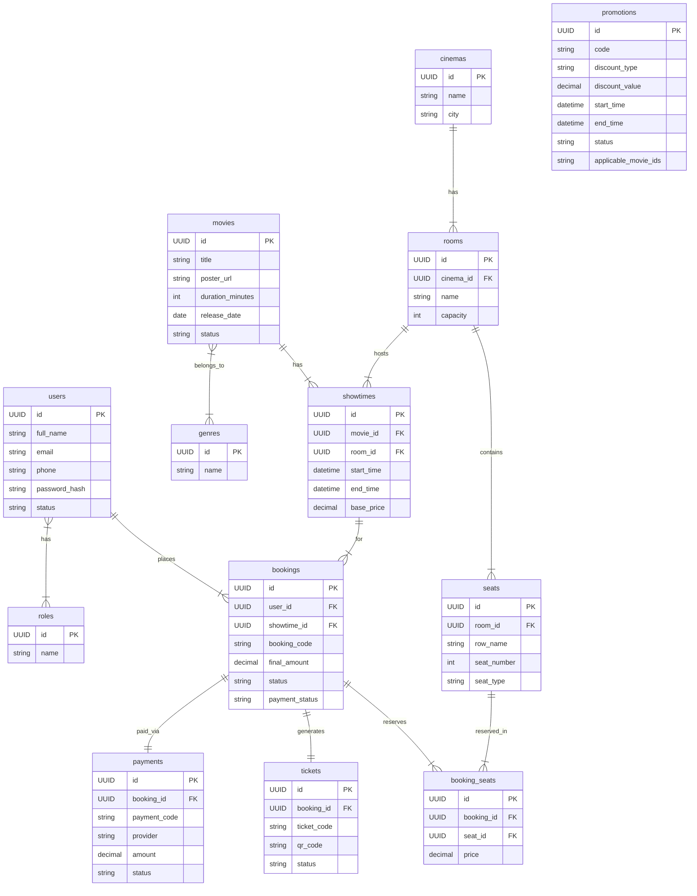
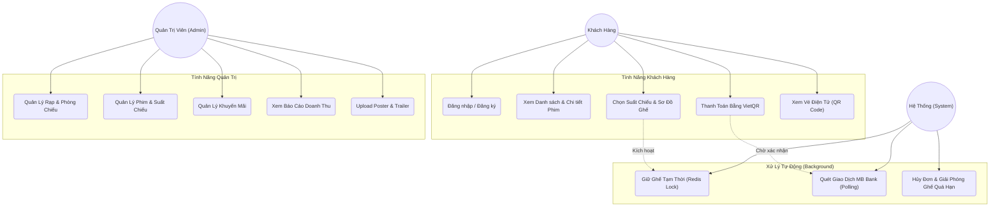

# 🎬 Cinema 8 Star — Hệ Thống Đặt Vé Xem Phim Trực Tuyến


**Cinema 8 Star** là một ứng dụng web toàn diện được thiết kế theo chuẩn công nghiệp phục vụ cho việc quản lý rạp chiếu phim và đặt vé trực tuyến. Hệ thống được xây dựng trên nền tảng **Java Spring Boot 3** (Backend) và **Vanilla JS + HTML5/CSS3** (Frontend), mang lại trải nghiệm mượt mà theo kiến trúc **SPA (Single Page Application)** mà không cần phụ thuộc vào các framework frontend nặng nề như React hay Vue.

> 🌐 **Website:** [cinema.dshinee.site](https://cinema.dshinee.site)  
> 📚 **Học phần:** Lập Trình Web Bằng Java — Khoa Công nghệ Thông tin

---

## 👥 Thành Viên Nhóm 8

| Họ và tên | Mã Sinh Viên | Vai trò |
|---|---|---|
| Nguyễn Văn Dũng | 2023601938 | Backend Lead & Kiến trúc hệ thống |
| Đặng Quốc Anh | 2023601601 | Frontend Developer |
| Trần Thị Hạnh | 2023603016 | UI/UX & Hiệu ứng giao diện |
| Hồ Sỹ Thành | 2023603010 | Thiết kế Cơ sở dữ liệu |
| Nguyễn Thanh Phương | 2023601876 | DevOps & Triển khai Cloud |

---

## 🚀 Hướng Dẫn Cài Đặt (A - Z)

### 📦 Phân Hệ 1: Chạy Dưới Local (Dành Cho Sinh Viên/Dev)

Để chạy dự án ngay trên máy tính cá nhân, hãy làm theo các bước sau:

**Bước 1: Cài đặt công cụ cần thiết**
- Cài đặt **Java 17** (hoặc mới hơn).
- Cài đặt **PostgreSQL** (cổng mặc định 5432).
- Cài đặt **Redis** (cổng mặc định 6379, trên Windows có thể dùng Memurai hoặc Docker).

**Bước 2: Cấu hình Database**
- Mở pgAdmin hoặc công cụ quản lý PostgreSQL, tạo một database trống có tên: `cinema_booking`.
- Sửa thông tin đăng nhập PostgreSQL tại file `src/main/resources/application.yml` cho phù hợp với máy bạn.

**Bước 3: Khởi chạy dự án**
- Mở terminal/CMD tại thư mục dự án `cinema-booking-api`.
- Chạy lệnh sau (lần đầu sẽ mất 1–3 phút để tải thư viện Maven):
  ```bash
  # Trên Windows
  .\mvnw.cmd spring-boot:run

  # Trên Mac/Linux
  ./mvnw spring-boot:run
  ```
- Nhờ tích hợp **Flyway**, hệ thống sẽ *tự động* tạo toàn bộ bảng và dữ liệu mẫu vào Database.

**Bước 4: Trải nghiệm**
- **Trang Landing Page:** `http://localhost:8080`
- **Trang Khách hàng (SPA):** `http://localhost:8080/home`
- **Trang Quản trị Admin:** `http://localhost:8080/admin`
  - *Tài khoản admin mặc định:* `admin@cinema.vn` / `admin123`

---

### ☁️ Phân Hệ 2: Triển Khai Lên Server Thực Tế (VPS Ubuntu)

Hệ thống có sẵn script deploy tự động 100%. Chỉ cần đăng nhập SSH vào VPS và chạy lệnh sau:

```bash
# 1. Vào thư mục dự án
cd ~/Cinema-Manager

# 2. Cập nhật mã nguồn mới nhất từ Github
git fetch --all && git reset --hard origin/main

# 3. Vào thư mục chứa API
cd cinema-booking-api

# 4. Chạy script tự động triển khai
bash deploy.sh
```

**Script này tự động làm:**
- Cài đặt **Docker & Docker Compose** nếu chưa có.
- Sinh khóa `JWT_SECRET` ngẫu nhiên siêu bảo mật.
- Build mã nguồn Java thành file thực thi.
- Khởi động đồng thời 4 dịch vụ: **Spring Boot**, **PostgreSQL**, **Redis**, **Nginx**.
- Hoàn thành trong dưới 3 phút!

---

## 🌟 Tổng Quan Kiến Trúc (Architecture Overview)

Hệ thống sử dụng kiến trúc **Monolith** được module hóa chặt chẽ theo mô hình **Layered Architecture**:

### ⚙️ Backend (Spring Boot)
| Tầng | Package | Vai trò |
|---|---|---|
| Controller | `com.cinema.*.controller` | Tiếp nhận HTTP requests, validate đầu vào, trả về JSON chuẩn |
| Service | `com.cinema.*.service` | Chứa toàn bộ Business Logic. Dùng `@Transactional` đảm bảo ACID |
| Repository | `com.cinema.*.repository` | Tương tác với PostgreSQL qua Spring Data JPA |
| Entity | `com.cinema.*.entity` | Map trực tiếp với các bảng trong Database (ORM) |
| Security | `com.cinema.security` | Xác thực Stateless bằng JWT, phân quyền USER/STAFF/ADMIN |

### 🗄️ Database (PostgreSQL + Redis + Flyway)
- **PostgreSQL**: Lưu trữ toàn bộ dữ liệu chính.
- **Flyway**: Quản lý phiên bản Database. Mỗi thay đổi cấu trúc bảng thêm vào một file SQL mới (V1, V2...), Flyway tự động đồng bộ khi khởi động.
- **Redis**: In-memory caching và Distributed Lock. Khi chọn ghế, Redis "giữ ghế" tạm thời 10 phút để ngăn 2 người đặt cùng 1 ghế.

### 🎨 Frontend (Vanilla SPA)
- Kiến trúc **SPA** — không dùng Thymeleaf/JSP truyền thống.
- **Light/Dark Mode** mượt mà, lưu trạng thái bằng `localStorage`.
- CSS thuần với biến toàn cục (CSS Variables), không Bootstrap/Tailwind.
- SVG Icons giúp giao diện sắc nét trên mọi màn hình.
- Client-side Router tự viết — giao tiếp hoàn toàn qua REST API + Fetch.

---

## 📂 Cấu Trúc Thư Mục Dự Án

```text
Cinema-Manager/
├── README.md                                # Tài liệu mô tả toàn bộ dự án
├── .gitignore
├── scripts/                                 # ── Các công cụ và script phụ trợ ──
│   ├── generate_daos.py                     # Script sinh code DAO mẫu
│   ├── generate_relations.py                # Script sinh code quan hệ
│   └── cinema_db_export.sql                 # File dump CSDL mẫu
│
└── cinema-booking-api/                      # ═══ MODULE CHÍNH ═══
    ├── pom.xml                              # Cấu hình Maven (thư viện, plugin)
    ├── Dockerfile                           # Build image Java cho Docker
    ├── docker-compose.yml                   # Chạy local (App + DB + Redis)
    ├── docker-compose.prod.yml              # Chạy production (thêm Nginx)
    ├── nginx.conf                           # Cấu hình Reverse Proxy
    ├── deploy.sh                            # Script deploy 1-click cho VPS
    ├── .env.example                         # Mẫu biến môi trường
    │
    └── src/main/
        ├── resources/
        │   ├── application.yml              # Cấu hình Spring Boot
        │   │
        │   ├── db/migration/                # ── Flyway Database Migration ──
        │   │   └── V1__init_database.sql    #    Khởi tạo toàn bộ bảng và dữ liệu mẫu
        │   │
        │   └── static/                      # ── Frontend (SPA) ──
        │       ├── landing.html             #    Landing Page giới thiệu
        │       ├── app.html                 #    Ứng dụng Khách hàng (SPA)
        │       ├── admin.html               #    Trang Quản trị Admin
        │       ├── cinema.jpg               #    Logo hiển thị trên web
        │       │
        │       ├── images/                  #    Logo công nghệ (Tech Stack)
        │       │   ├── spring.png
        │       │   ├── postgreSQL.png
        │       │   ├── redis.png
        │       │   ├── docker.jpg
        │       │   ├── jwt.jpg
        │       │   ├── css3.png
        │       │   ├── js.jpg
        │       │   ├── flyway.png
        │       │   └── nginx.png
        │       │
        │       ├── css/
        │       │   ├── style.css            #    Design System (tokens, theme)
        │       │   ├── components.css       #    UI Components (sơ đồ ghế...)
        │       │   └── admin.css            #    Design System cho Admin
        │       │
        │       └── js/
        │           ├── app.js               #    Khởi tạo App, Theme, Modal
        │           ├── api.js               #    HTTP Client (Fetch + JWT)
        │           ├── auth.js              #    Xác thực (Đăng nhập, Đăng ký)
        │           ├── router.js            #    Client-side Router (SPA)
        │           │
        │           ├── pages/               # ── Trang Khách hàng ──
        │           │   ├── home.js          #    Trang chủ (Hero + Phim)
        │           │   ├── movies.js        #    Danh sách phim
        │           │   ├── movie-detail.js  #    Chi tiết phim
        │           │   ├── seats.js         #    Sơ đồ ghế (real-time)
        │           │   ├── booking.js       #    Thanh toán VietQR
        │           │   ├── my-tickets.js    #    Lịch sử vé đã đặt
        │           │   └── profile.js       #    Hồ sơ cá nhân
        │           │
        │           └── admin/               # ── Trang Quản trị ──
        │               ├── admin-app.js     #    Khởi tạo Admin + Sidebar
        │               ├── dashboard.js     #    KPI + Biểu đồ doanh thu
        │               ├── movies.js        #    CRUD Phim
        │               ├── cinemas.js       #    CRUD Rạp chiếu
        │               ├── showtimes.js     #    CRUD Suất chiếu
        │               ├── bookings.js      #    Quản lý đơn đặt vé
        │               ├── users.js         #    Quản lý người dùng
        │               ├── promotions.js    #    Quản lý khuyến mãi
        │               └── reports.js       #    Báo cáo doanh thu
        │
        └── java/com/cinema/                 # ═══ CÁC MODULE BACKEND ═══
            ├── CinemaBookingApplication.java #    Entry point (điểm khởi chạy)
            │
            ├── config/                      # ── Cấu hình hệ thống ──
            │   ├── AdminDataInitializer.java #    Tạo tài khoản admin mặc định
            │   ├── AsyncConfig.java         #    Xử lý bất đồng bộ
            │   ├── AuditConfig.java         #    Tự động ghi createdAt/updatedAt
            │   ├── CorsConfig.java          #    Cấu hình CORS
            │   ├── RedisConfig.java         #    Kết nối Redis
            │   ├── SwaggerConfig.java       #    Tài liệu API tự động
            │   └── WebConfig.java           #    Routing SPA fallback
            │
            ├── controller/                  # ── Controller đặc biệt ──
            │   └── SpaForwardController.java #   Chuyển tiếp request tới file HTML
            │
            ├── security/                    # ── Bảo mật & JWT ──
            │   ├── SecurityConfig.java      #    Cấu hình Spring Security
            │   ├── JwtTokenProvider.java    #    Tạo & xác thực JWT
            │   ├── JwtAuthenticationFilter.java #    Filter kiểm tra token
            │   ├── JwtProperties.java       #    Biến môi trường JWT
            │   ├── CustomUserDetails.java   #    Chi tiết User đăng nhập
            │   ├── UserDetailsServiceImpl.java #   Load thông tin User
            │   ├── SecurityUtils.java       #    Lấy thông tin User hiện tại
            │   ├── CustomAccessDeniedHandler.java #  Xử lý lỗi 403 Forbidden
            │   └── CustomAuthenticationEntryPoint.java # Xử lý lỗi 401 Unauthorized
            │
            ├── common/                      # ── Dùng chung ──
            │   ├── ApiResponse.java         #    Wrapper chuẩn cho response JSON
            │   ├── BaseEntity.java          #    Entity gốc (id, timestamps)
            │   ├── Constants.java           #    Hằng số hệ thống
            │   ├── PageResponse.java        #    Wrapper phân trang
            │   ├── controller/FileUploadController.java # Xử lý Upload file
            │   └── exception/               #    ── Quản lý Lỗi Toàn Cục ──
            │       ├── GlobalExceptionHandler.java # Bắt mọi Exception
            │       ├── BusinessException.java   # Lỗi nghiệp vụ (Logic)
            │       ├── ResourceNotFoundException.java # Lỗi không tìm thấy 404
            │       └── ErrorCode.java           # Định nghĩa mã lỗi chuẩn
            │
            ├── auth/                        # ── Xác thực ──
            │   ├── controller/AuthController.java # API Đăng nhập, Đăng ký
            │   ├── service/AuthService.java     # Logic xử lý xác thực
            │   └── dto/ (LoginRequest, RegisterRequest, TokenResponse) # Payload Data
            │
            ├── movie/                       # ── Quản lý Phim ──
            │   ├── controller/ (MovieController, GenreController) # API Phim và Thể loại
            │   ├── service/MovieService.java    # Logic nghiệp vụ Phim
            │   ├── entity/ (MovieEntity, GenreEntity) # Bảng Movies và Genres
            │   ├── repository/ (MovieRepository, GenreRepository) # Giao tiếp Database
            │   └── dto/ (MovieDto, CreateMovieRequest) # Payload đầu vào/ra
            │
            ├── cinema/                      # ── Quản lý Rạp ──
            │   ├── controller/CinemaController.java # API Rạp chiếu phim
            │   ├── entity/CinemaEntity.java     # Bảng Cinemas
            │   └── repository/CinemaRepository.java # Truy xuất Rạp
            │
            ├── room/                        # ── Phòng chiếu ──
            │   ├── entity/RoomEntity.java       # Bảng Rooms
            │   └── repository/RoomRepository.java # Truy xuất Phòng
            │
            ├── seat/                        # ── Ghế ngồi ──
            │   ├── entity/SeatEntity.java       # Bảng Seats (VIP, Thường, Đôi)
            │   └── repository/SeatRepository.java # Truy xuất Ghế
            │
            ├── showtime/                    # ── Suất chiếu ──
            │   ├── controller/ShowtimeController.java # API Lịch chiếu
            │   ├── service/ShowtimeService.java # Logic xử lý Suất chiếu
            │   ├── entity/ShowtimeEntity.java   # Bảng Showtimes
            │   ├── repository/ShowtimeRepository.java # Truy xuất Lịch chiếu
            │   └── dto/ (ShowtimeDto, CreateShowtimeRequest) # Payload Suất chiếu
            │
            ├── booking/                     # ── Đặt vé ──
            │   ├── controller/ (BookingController, AdminBookingController) # API Đặt vé (User/Admin)
            │   ├── service/BookingService.java  # Logic đặt vé, tính tiền
            │   ├── entity/ (BookingEntity, BookingSeatEntity) # Bảng Bookings
            │   ├── repository/ (BookingRepository, BookingSeatRepository) # Lưu Đơn hàng
            │   └── dto/ (BookingDto, CreateBookingRequest, HoldSeatsRequest) # DTO Đặt vé/Giữ ghế
            │
            ├── ticket/                      # ── Vé xem phim ──
            │   ├── controller/TicketController.java # API Vé (QR Code)
            │   ├── service/TicketService.java   # Logic tạo và kiểm tra vé
            │   ├── entity/TicketEntity.java     # Bảng Tickets
            │   └── repository/TicketRepository.java # Truy xuất Vé
            │
            ├── payment/                     # ── Thanh toán ──
            │   ├── controller/ (PaymentController, PaymentCallbackController) # API Thanh toán
            │   ├── service/ (PaymentService, MbbankService) # Logic thanh toán VietQR
            │   ├── entity/ (PaymentEntity, RefundTransactionEntity) # Lịch sử giao dịch
            │   ├── repository/PaymentRepository.java # Lưu trữ giao dịch
            │   └── scheduler/PaymentScheduler.java # Quét giao dịch tự động
            │
            ├── promotion/                   # ── Khuyến mãi ──
            │   ├── controller/PromotionController.java # API Mã giảm giá
            │   ├── entity/PromotionEntity.java  # Bảng Promotions
            │   └── repository/PromotionRepository.java # Truy xuất Khuyến mãi
            │
            ├── report/                      # ── Báo cáo doanh thu ──
            │   └── controller/ReportController.java # API Thống kê Dashboard
            │
            ├── scheduler/                   # ── Tác vụ định kỳ ──
            │   └── BookingExpirationScheduler.java # Tự hủy đơn chưa thanh toán
            │
            └── user/                        # ── Người dùng ──
                ├── controller/UserController.java # API Quản lý tài khoản
                ├── entity/ (UserEntity, RoleEntity) # Bảng Users và Roles
                └── repository/ (UserRepository, RoleRepository) # DB Người dùng
```

---

## 📊 Sơ Đồ Thiết Kế (Design Diagrams)

### 1. Sơ Đồ Thực Thể Liên Kết (Entity Relationship Diagram - ERD)
Hệ thống quản lý cơ sở dữ liệu quan hệ với các bảng được liên kết chặt chẽ, tối ưu hóa cho tốc độ truy vấn và quản lý giao dịch.



### 2. Sơ Đồ Use Case (Use Case Diagram)
Mô tả sự tương tác giữa các tác nhân (Khách Hàng, Quản Trị Viên) và các luồng xử lý tự động ngầm của Hệ Thống.



---

## 🔥 Tính Năng Cốt Lõi & Cách Hoạt Động

### 2.1 Luồng Đặt Vé & Giữ Ghế (Xử lý Concurrency)
Đây là bài toán khó nhất: Làm sao để 2 người cùng đặt 1 ghế không bị lỗi?

1. User chọn ghế → gọi `POST /api/v1/bookings/hold`.
2. Backend dùng **Redis Atomic Lock**: `setIfAbsent(key, value, 10 phút)`.
   - `true` → Ghế trống, giữ thành công. Trạng thái Booking = `HOLDING`.
   - `false` → Đã có người giữ → Báo lỗi cho User.
3. Nếu không thanh toán trong 10 phút, `BookingExpirationScheduler` tự động hủy và trả ghế về.

### 2.2 Thanh Toán Tự Động (MB Bank Polling)
Không dùng cổng thanh toán trung gian đắt tiền:

1. User xác nhận đơn → Hệ thống sinh mã VietQR với nội dung động (VD: `PAY123456`).
2. `PaymentScheduler` gọi API DVSTEAM (lịch sử giao dịch MB Bank) mỗi 30 giây.
3. Quét nội dung chuyển khoản và số tiền.
4. Nếu khớp → Tự động duyệt đơn → Sinh vé điện tử → Xóa lock Redis.

### 2.3 Bảo Mật API (Spring Security + JWT)
1. Đăng nhập thành công → Server sinh **JWT Token** gửi về Frontend.
2. Frontend lưu JWT vào `localStorage`.
3. Mỗi request tiếp theo đính kèm: `Authorization: Bearer <token>`.
4. `JwtAuthenticationFilter` giải mã, lấy thông tin User và Quyền.
5. `SecurityConfig` định nghĩa URL nào ai được vào (VD: `/api/v1/admin/**` yêu cầu role `ADMIN`).

---

## 🎨 Thiết Kế Giao Diện (UI/UX Design System)

- **CSS Variables (Token-based)**: Tách biệt hoàn toàn giữa logic màu sắc và component.
- **Không Bootstrap/Tailwind**: Code CSS thuần giúp hiểu sâu Flexbox, Grid, CSS Animation.
- **Micro-interactions**: Hiệu ứng hover trên nút bấm, thẻ thống kê tạo cảm giác chiều sâu.
- **Chart.js**: Tự động đồng bộ màu biểu đồ theo Dark/Light Mode.
- **Responsive 100%**: Tối ưu đầy đủ cho Mobile, Tablet và Desktop.

---

## 🔍 Tối Ưu Hóa SEO

Cả trang Landing Page và SPA đều được tối ưu SEO kỹ lưỡng:

| Hạng mục | Mô tả |
|---|---|
| **Thẻ Meta** | `title`, `description` (~160 ký tự), `keywords` |
| **Open Graph** | Chia sẻ đẹp trên Facebook, Zalo, LinkedIn với ảnh bìa |
| **Twitter Card** | Hiển thị preview card khi chia sẻ trên X (Twitter) |
| **JSON-LD Schema** | `Organization`, `MovieTheater` — Google có thể lập chỉ mục chi tiết |
| **Canonical URL** | Tránh trùng lặp nội dung, chỉ định URL chính thức |
| **Favicon & PWA** | Icon trên tab trình duyệt và màn hình điện thoại |

---

## 🛠 Tổng Hợp Công Nghệ (Tech Stack)

### ⚙️ Backend
| Công nghệ | Phiên bản | Mục đích |
|---|---|---|
| Java & Spring Boot | 17 / 3.x | Framework cốt lõi |
| Spring Security & JWT | 6.x | Bảo mật Stateless |
| Spring Data JPA & Hibernate | - | Truy xuất Database (ORM) |
| Lombok | - | Giảm boilerplate code |
| Swagger / OpenAPI | 3 | Tài liệu API tự động |

### 🗄️ Database & Caching
| Công nghệ | Mục đích |
|---|---|
| PostgreSQL 16 | Lưu trữ dữ liệu chính |
| Redis | Giữ ghế tạm thời (Distributed Lock) |
| Flyway | Quản lý phiên bản Database |

### 🎨 Frontend & UI/UX
| Công nghệ | Mục đích |
|---|---|
| HTML5 & Vanilla CSS3 | Giao diện thuần, không framework |
| Vanilla JavaScript (ES6+) | SPA + Fetch API |
| Chart.js | Biểu đồ thống kê doanh thu |

### 🚀 Tích Hợp & DevOps
| Công nghệ | Mục đích |
|---|---|
| DVSTEAM API | Kiểm tra lịch sử giao dịch MB Bank |
| Docker & Docker Compose | Đóng gói và triển khai dễ dàng |
| Nginx | Reverse Proxy + SSL termination |
| Shell Script (`deploy.sh`) | CI/CD tự động trên VPS |

---

## 🇻🇳 Việt Hóa & Bản Địa Hóa (Localization)

Hệ thống đã được bản địa hóa toàn diện (Localization) 100% sang tiếng Việt chuyên nghiệp, bao gồm:
- **Giao diện người dùng (UI)**: Toàn bộ nhãn, thông báo, lỗi và tài liệu hướng dẫn.
- **Mã nguồn (Source Code)**: Toàn bộ chú thích (comments) trong Java (Backend), JavaScript và CSS (Frontend) đã được chuyển đổi sang tiếng Việt để dễ dàng bảo trì.
- **Tài liệu API (Swagger)**: Các mô tả API được trình bày bằng tiếng Việt rõ ràng.
- **Thông báo thành công/lỗi**: Toàn bộ chuỗi văn bản trả về từ Server đã được chuẩn hóa.

---

## 🏆 Đơn Vị Phát Triển

Dự án **Cinema 8 Star** được thiết kế và phát triển bởi **Nhóm 8** trong khuôn khổ học phần **Lập Trình Web Bằng Java**.

Mục tiêu cốt lõi là hiện thực hóa tiêu chuẩn của một hệ thống Enterprise Software, kết nối giữa:
- Kiến trúc Backend chịu tải cao (High-Concurrency).
- Thiết kế giao diện tối giản, hiện đại (Pro Max UI/UX).
- Xử lý nghiệp vụ tự động hóa (Automated Payment Processing).

> 📧 **Liên hệ & Hỗ trợ:**  
> - **Github:** [github.com/dungnguyen0537](https://github.com/dungnguyen0537)  
> - **Bản quyền:** © 2026 Cinema 8 Star — Nhóm 8. All rights reserved.

